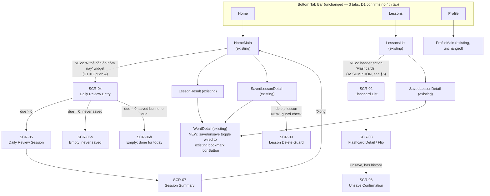
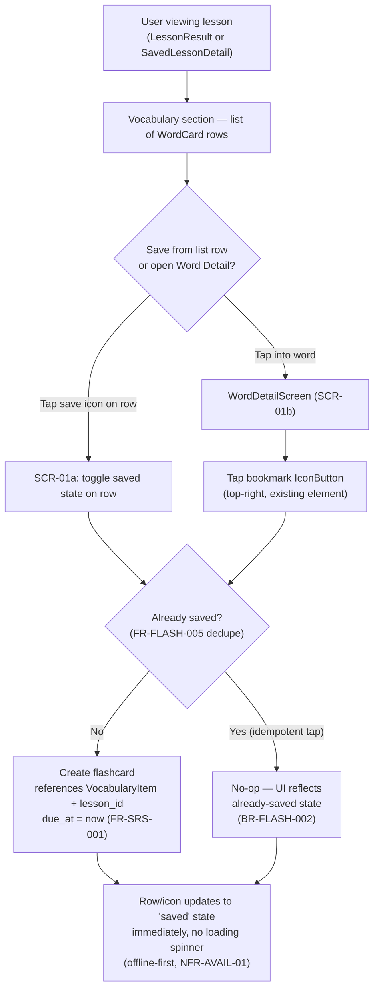
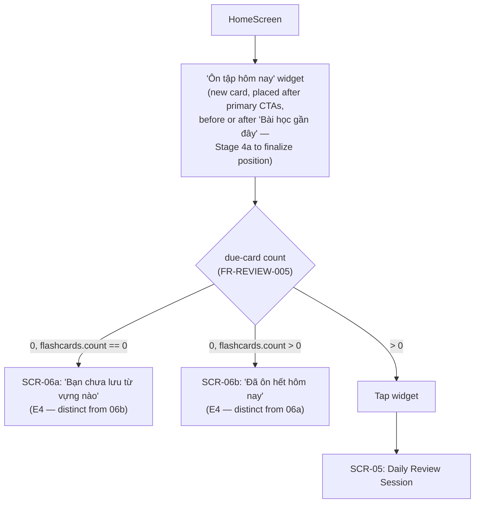
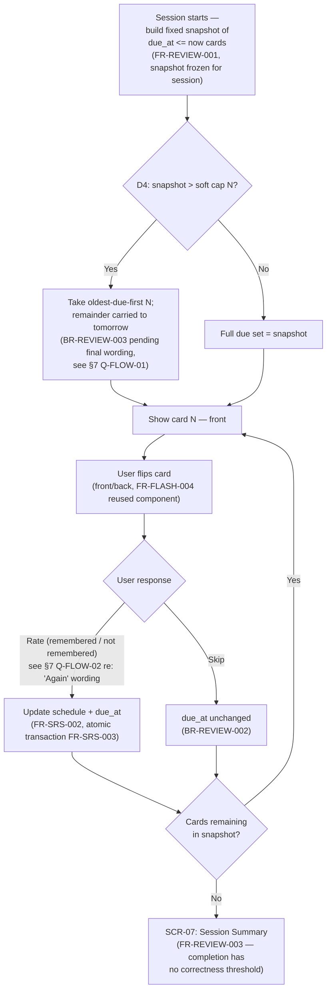
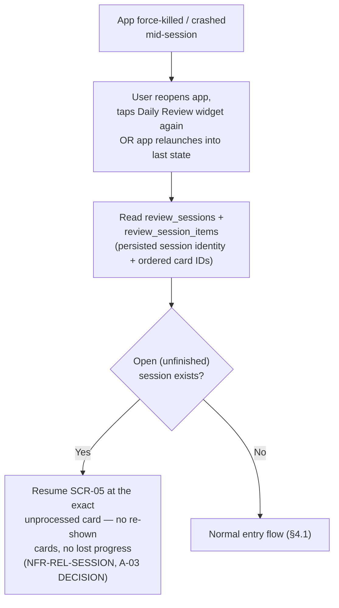
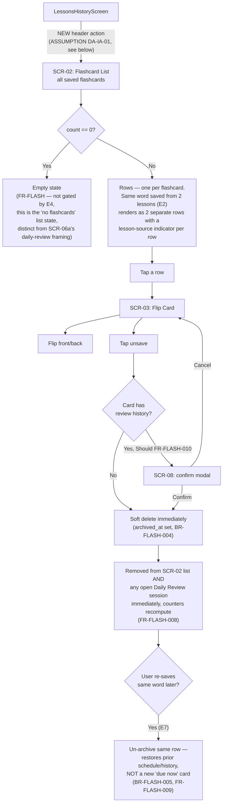
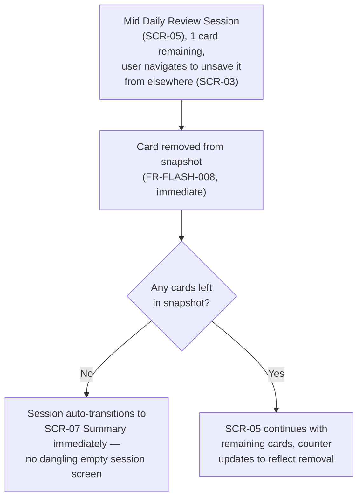
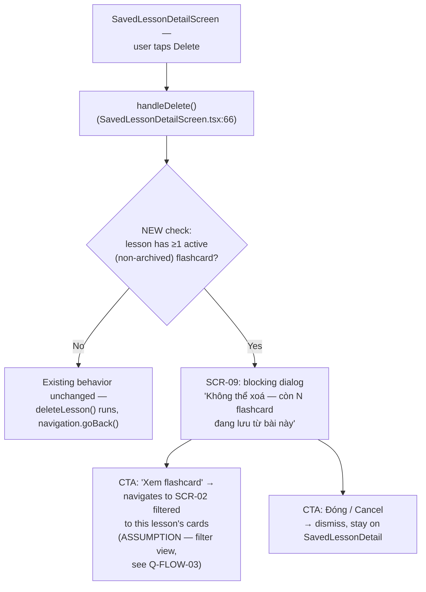

# Stage 3 — IA, Task/User/Screen Flows, Exception Paths
## P1 Flashcards / SRS / Daily Review

> Issue: [VIB-127](mention://issue/7e4baeed-e7cc-446d-aad1-59b865d6b981). Builds on Stage 1 ([VIB-125](mention://issue/fa472275-4099-4dfe-a898-9dc298129bbf)) and Gate 1 approval ([VIB-126](mention://issue/6e4c65c6-2242-47e3-a7bb-3182a14147e9), all 4 defaults accepted: D1 Home widget entry, D2 block/RESTRICT delete guard, D3 fixed-interval SRS, D4 soft-cap queue).
> Labels: `FACT` / `ASSUMPTION` / `QUESTION` / `RISK` / `CONFLICT` / `DECISION`. Unlabeled prose is structural description, not a requirements claim.
> Codebase references verified directly against the repo at commit `f719a97` (not inherited from BA/Design Lead claims): `src/app/navigation/AppNavigator.tsx`, `src/modules/lesson/WordDetailScreen.tsx`, `src/modules/lesson/SavedLessonDetailScreen.tsx`, `src/shared/db/LessonRepository.ts`, `src/components/*`.

---

## 1. Information Architecture — updated sitemap

`FACT`: current nav is exactly 3 tabs (`AppNavigator.tsx:152-162`), no 4th tab exists. `DECISION` (inherited, Gate 1 D1): Daily Review entry lives on Home, not a tab.

---

## 2. Screen Inventory (confirmed / refined from Stage 1)

| ID | Screen | Type | Stack | Entry point(s) | Component reuse |
|---|---|---|---|---|---|
| SCR-01a | Vocabulary list row — save affordance | Modified | Home/Lessons stack (inline, not own screen) | Vocabulary section of `LessonResultScreen`, `SavedLessonDetailScreen` | `WordCard` — needs saved-state prop (§6) |
| SCR-01b | Word Detail — save/unsave toggle | Modified | Home/Lessons stack | `WordDetailScreen` (already has an unwired `bookmark` `IconButton` at `WordDetailScreen.tsx:34`) | `IconButton` (wire existing) |
| SCR-02 | Flashcard List | New | Lessons stack | Header action on `LessonsHistoryScreen` (`ASSUMPTION`, §5) | `ListRow` or `LessonCard` pattern |
| SCR-03 | Flashcard Detail / Flip | New | Lessons stack (pushed from SCR-02) | Tap a row on SCR-02 | New flip component (design-system gap, Stage 6 per Stage 1) |
| SCR-04 | Daily Review Entry | New | Home stack (widget, not a screen push until tapped) | `HomeScreen` — new card below/near "Bài học gần đây" | New widget; `SectionHeader` pattern for label |
| SCR-05 | Daily Review Session | New | Home stack, modal-like (`gestureEnabled: false`, mirrors `Analyzing`) | Tap SCR-04 widget when due > 0 | New rating control (gap, Stage 6) |
| SCR-06a | Empty — never saved | New (state) | Rendered in place of SCR-05 push, or inline on SCR-04 widget | due = 0 AND flashcard count = 0 | — |
| SCR-06b | Empty — done for today | New (state) | Same slot as SCR-06a | due = 0 AND flashcard count > 0 | — |
| SCR-07 | Session Summary | New | Home stack (replaces SCR-05 in stack, not pushed on top — see §4.4) | Snapshot fully processed | — |
| SCR-08 | Unsave confirmation | New (modal, Should) | Overlay on SCR-03 | Unsave tapped on a card with review history | `Alert`-style pattern (`ProfileScreen.tsx` uses `Alert.*` today) or a themed modal — Stage 4a to decide, flag at Stage 6 gap list |
| SCR-09 | Lesson delete guard | New (blocking dialog) | Overlay on `SavedLessonDetailScreen` | `handleDelete()` at `SavedLessonDetailScreen.tsx:66` when lesson has ≥1 active flashcard | Same modal pattern as SCR-08 |

`FACT`: `WordDetailScreen.tsx:34` already renders a `bookmark` `IconButton` with no `onPress` — this is the natural SCR-01b hook, not a new component.
`FACT`: `SavedLessonDetailScreen.tsx:66-72` (`handleDelete`) calls `deleteLesson()` directly today with no flashcard check — this is exactly where the SCR-09 guard must intercept.

---

## 3. Task Flow — Save flashcard from vocabulary (FR-FLASH-001/002/005/006, US-016)

States on SCR-01a/b: **Normal** (unsaved, icon outline) / **Success** (saved, icon filled + tone change) — no Loading state (local DB write, NFR-AVAIL-01 says no network wait) / no Error state surfaced to user for this action (`ASSUMPTION` DA-IA-02: a local SQLite insert failure here is treated as a silent-retry-on-next-render case, not a user-facing error, consistent with how `deleteLesson` already swallows exceptions and returns `false` in `LessonRepository.ts:216`; flag to Stage 4a if this needs an explicit error toast instead).

---

## 4. User Flow — Daily Review (entry → session → summary)

### 4.1 Entry (SCR-04, D1 = Home widget)

`FACT` (FR-REVIEW-005 = Should, not Must): the due-count badge on the widget itself is Should-priority. The empty-state distinction (E4 / FR-REVIEW-004) is Must — both empty states must exist even if the count badge ships later.

### 4.2 Session loop (SCR-05, D3 = fixed interval, D4 = soft cap)

States on SCR-05: **Normal** (card N of total shown) / **Loading** (session start — building snapshot, and resume-after-crash, see §4.3) / **Disabled** (rating buttons mid-transition, per Stage 1 skeleton — prevents double-submit on the atomic transaction) / **Other**: capped-queue banner state ("N thẻ, còn lại M thẻ mai ôn tiếp") when D4 trim applied. No Error state for the core loop (offline-first); a transaction failure on rating write is a `RISK` to flag for Stage 4a — needs at least a non-blocking retry affordance since BR-SRS-003/FR-SRS-003 require the mutation to be atomic and shouldn't silently drop the user's rating.

### 4.3 Exception — resume after crash (E5, A-03)

This is a data/session-identity requirement, not a distinct screen (per Stage 1 DA note) — the only UI implication is that SCR-05's Loading state must cover "resuming an existing session," which should feel identical to "starting a fresh one" (no separate "resuming..." screen needed, brief spinner suffices).

### 4.4 Session → Summary transition

`DECISION` (this Stage): SCR-07 **replaces** SCR-05 in the navigation stack (`navigation.replace`, not `.push`) — back gesture/button from the summary should return to Home, not back into a finished session. Rationale: the session snapshot is spent; there is nothing to navigate back into, and BR-REVIEW-002's fixed-snapshot model means re-entering SCR-05 after completion should route through §4.1 (which will show SCR-06b, not the same session). Flag to Stage 4a for confirmation since it's a navigation-stack detail not explicitly covered by Gate 1.

---

## 5. Task Flow — Flashcard List, view/flip, unsave/re-save (FR-FLASH-003/004/007/008/009/010, US-017/018/021, E2, E6, E7)

`ASSUMPTION` **DA-IA-01**: Gate 1 (D1–D4) only resolved the *Daily Review* entry point, not the *Flashcard List* (SCR-02) entry point — these are two different destinations (a review session vs. browsing all saved cards) and the gate description never distinguishes them. This flow assumes SCR-02 is reached via a new header action on the existing `LessonsHistoryScreen` (icon button, same pattern as the `bookmark` `IconButton` already on `WordDetailScreen`) — chosen because it adds zero nav-structure change (no tab, no new top-level destination) and keeps saved vocabulary content grouped with saved lessons, consistent with the "Lessons" tab's existing purpose. `QUESTION` for Design Lead/Product Owner: confirm this placement before Stage 4a wireframes it, since it wasn't one of the four gated D-items.

### Exception — unsave the last in-progress card mid-review (E6)

This requires SCR-05's "remaining count" to be reactive to flashcard state, not computed once at session start (frozen snapshot per BR-REVIEW-002 governs *card content and ordering*, not *counter display* — the counter must reflect live removals; this reading is consistent with FR-FLASH-008's "kể cả session đang mở" wording, flagged as `DECISION` of this Stage since Stage 1 didn't spell out how frozen-snapshot and live-unsave interact).

---

## 6. Exception Flow — Lesson delete with active flashcards (E1 / CRIT-002, Gate 1 D2 = block/RESTRICT)

States on SCR-09: only **Normal** (shown) and dismissed — this is a blocking modal, not a routed screen, so it has no independent Loading/Error states; the underlying delete action it blocks already has its own error path (`DELETE_LESSON_ERROR_MESSAGE`, unchanged).

`RISK` (inherited, restated for Stage 4a): `deleteLesson()` at `LessonRepository.ts:206-214` performs a hard `DELETE FROM lessons` with no flashcard-awareness today — the guard in this flow is a **new precondition check that must ship before or atomically with this delete**, not a UI-only affordance. Flag to whichever engineering issue implements this Stage's handoff.

`QUESTION` **Q-FLOW-03**: should SCR-02 support a "filtered by lesson" view (needed for the CTA above), or should the CTA instead deep-link into the lesson's own vocabulary section highlighting the saved items? Both satisfy "help the user find what to unsave" — Stage 4a should pick one; noting it here so it isn't invented silently during wireframing.

---

## 7. State Inventory (expands Stage 1 skeleton)

| Screen | Normal | Loading | Empty | Error | Success | Disabled | Permission-denied | Other |
|---|---|---|---|---|---|---|---|---|
| SCR-01a/b Save toggle | Unsaved (outline icon) | — (local write, no wait) | — | — (see DA-IA-02) | Saved (filled icon) | — | N/A (no roles, P1 inherits P0 anonymous model) | — |
| SCR-02 Flashcard List | List of rows | Brief local-DB read | No flashcards saved (E2 distinct copy from SCR-06a) | — (offline-first) | — | — | N/A | Filtered-by-lesson (Q-FLOW-03) |
| SCR-03 Flip Card | Front/back | — | — | — | Unsave toast/confirmation | — | N/A | — |
| SCR-04 Entry widget | Due count > 0 | — | Due = 0 → routes to 06a/06b | — | — | — | N/A | — |
| SCR-05 Review Session | Card N of total | Session start / resume-after-crash (E5) | → routes to 06a/06b before session starts | Rating-write failure (RISK, §4.2) | — | Rating buttons mid-transition | N/A | Capped-queue banner (D4) |
| SCR-06a Empty — never saved | shown | — | is the empty state | — | — | — | N/A | — |
| SCR-06b Empty — done today | shown | — | is the empty state | — | — | — | N/A | — |
| SCR-07 Summary | shown | — | — | — | is the success state | — | N/A | — |
| SCR-08 Unsave confirm | shown (modal) | — | — | — | confirm → closes | Cancel button | N/A | — |
| SCR-09 Delete guard | shown (modal) | — | — | — | — | — | N/A | — |

Permission-denied is N/A across the board — `FACT`, confirmed against input package §9 ("Không có role/permission mới — P1 kế thừa mô hình P0 anonymous_user_id").

---

## 8. Open items for Design Lead / Product Owner (not silently resolved)

| ID | Item | Why it's open | Blocking? |
|---|---|---|---|
| DA-IA-01 | Flashcard List (SCR-02) entry point assumed to be a header action on `LessonsHistoryScreen` | Gate 1's D1–D4 covered Daily Review entry only, not this one | Not blocking Stage 3 output; should be confirmed before Stage 4a wireframes SCR-02's parent screen |
| Q-FLOW-01 | Exact carry-over wording/UX for D4 soft cap ("N left, continue tomorrow") | BR-REVIEW-003 is still "open decision" text in the PRD even though D4 = Option 2 was accepted at Gate 1 as a default — the PRD itself hasn't been re-worded post-gate | Not blocking Stage 3; blocking Stage 4a state matrix per Stage 1 |
| Q-FLOW-02 | BR-REVIEW-002 uses "Again → relearning" (SM-2-flavored language) but D3 resolved to fixed-interval (2-outcome rate/skip, not 4-level) | Possible terminology mismatch between an SM-2-era business rule and the fixed-interval decision that superseded it | Should resolve before Stage 4b writes rating-button copy |
| Q-FLOW-03 | Should SCR-09's "Xem flashcard" CTA open a lesson-filtered flashcard list, or deep-link into the lesson's vocabulary section? | Not specified by Gate 1 or PRD §9.1 | Blocking Stage 4a wireframe of SCR-09 |
| DA-IA-02 | Local-write failures on save/unsave/rate are assumed silent (consistent with existing `deleteLesson` swallow-and-return-false pattern) rather than surfaced as user-facing errors | No explicit NFR/AC covers this failure mode for flashcard writes | Not blocking; flag to Stage 4a in case product wants an explicit error state |
| §4.4 | Session→Summary uses `navigation.replace`, not `.push` | Not specified at Gate 1; navigation-stack detail this Stage is deciding | Not blocking; confirm at Stage 4a |

None of these affect the Must-priority flows above — they are refinements Stage 4a needs before locking wireframes, not gaps that stall Stage 3's handoff.

---

## 9. Traceability (additions to Stage 1 skeleton)

| Requirement | Flow section | Screen(s) | AC ref |
|---|---|---|---|
| FR-FLASH-001/002/005/006 | §3 | SCR-01a, SCR-01b | AC-FLASH-001..003 |
| FR-FLASH-003/004 | §5 | SCR-02, SCR-03 | AC-FLASH-004..008 |
| FR-FLASH-007/008/009/010 | §5 | SCR-03, SCR-08 | AC-FLASH-009+ |
| FR-SRS-001/002/003 | §4.2 | SCR-05 | AC-SRS-* |
| FR-REVIEW-001/002/003 | §4.2 | SCR-05, SCR-07 | AC-REV-001..006 |
| FR-REVIEW-004 (E4) | §4.1 | SCR-06a, SCR-06b | AC-REV-007 |
| FR-REVIEW-005 | §4.1 | SCR-04 | — |
| NFR-REL-SESSION (A-03) | §4.3 | SCR-05 | — |
| CRIT-002 / E1 | §6 | SCR-09 | — |
| E2 | §5 | SCR-02 | — |
| E5 | §4.3 | SCR-05 | — |
| E6 | §5 | SCR-05, SCR-03 | — |
| E7 | §5 | SCR-03 | — |

---

**Self-status:** Per Design Team Sub-issue Status Rule, VIB-127 will be self-closed to `done` on submission. Stage 4 promotion is Design Lead's call, not this Stage's.
