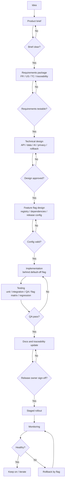
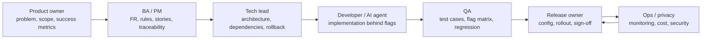

# Phase N Workflow & Release Governance

## 1. Purpose

This document defines the standard workflow for taking a new product idea from initial concept to a
controlled release in any future phase after the current Phase 0 foundation.

Use this document when planning or implementing a new phase, module track, feature module, or release
bundle that is not already fully covered by the Phase 0 M0-M5 implementation plan.

This document does not replace:

- `04-product/06-roadmap-release-plan.md` for product phase direction.
- `02-technical/07-modular-architecture-and-release.md` for module track and release strategy.
- `02-technical/08-feature-registry-release-config.md` for feature flags, dependencies, and release JSON.
- `03-requirements/05-traceability-matrix.md` for FR/US/TC/status tracking.
- `07-release/01-release-production-readiness.md` for release gates.
- `00-DOC-CONVENTION.md` for file naming, folder layout, and phase kickoff checklist.
- `00-ship-trackers/p{N}-ship-tracker.md` for per-phase ship status (thin hub — no spec copy).

## 2. When to use this workflow

Use this workflow for:

- A new product phase such as P2, P3, or a future Phase N.
- A new module track such as speaking, monetization, import, sync, or tutor.
- A new feature that may ship independently behind a release flag.
- A change that affects navigation, API routes, data model, AI contract, privacy, cost, or release scope.

Do not use this workflow for:

- Small copy fixes.
- Internal refactors with no product behavior change.
- Phase 0 milestone work that is already governed by `02-implementation-plan-m1-m5.md`.

Even for small product features, the minimum rule still applies:

```text
Idea -> FR/US/TC -> feature flag/dependency decision -> implementation -> QA -> release decision
```

## 3. Core principles

1. Product phases describe user value. They do not define build order by themselves.
2. Module tracks define code ownership and capability boundaries.
3. Releases are named flag bundles that enable only completed, tested, dependency-valid modules.
4. New work must extend the core loop, not replace it:

```text
Scan/Input -> Confirm Text -> Generate Lesson -> Learn -> Save -> Review
```

5. Incomplete features may merge only when they are hidden behind a default-off flag.
6. No feature is release-ready until it has loading, error, and empty states.
7. No feature is done until traceability status and QA evidence are updated.
8. Rollback must be designed before release, not after an incident.
9. AI schema changes must start from `01-schema/01-ai-output-v1.ts`; do not invent app-only fields.
10. Sensitive content must not be logged in mobile, API, analytics, or crash reports.

## 4. Phase N lifecycle overview

```text
Idea
-> Product brief
-> Requirements package
-> Technical design
-> Module and feature flag design
-> Implementation behind default-off flag
-> Unit / integration / QA / flag matrix testing
-> Traceability and documentation update
-> Release candidate
-> Staged rollout
-> Monitoring
-> Keep on, iterate, or rollback by flag
```

Each stage has a gate. Do not skip a gate because the feature seems simple.

### Visual workflow



### Responsibility map



## 5. Stage 1 -- Idea intake

### Goal

Turn a raw idea into a clear product problem.

### Required questions

- What user problem does this solve?
- Which learner group is affected?
- Which product phase does it belong to?
- Does it improve acquisition, learning quality, retention, speaking, expansion, or monetization?
- Does it depend on saved lessons, AI analysis, OCR, audio, account, sync, or payment?
- Does it change the core loop?
- Does it introduce new privacy, cost, provider, or store-review risk?

### Output

Create or update a short product brief in the relevant product docs folder.

Suggested location:

```text
docs/01-ba/04-product/
```

### Gate

The idea may move forward only when its user value, phase fit, and risk level are clear.

## 6. Stage 2 -- Product brief

### Goal

Define the intended product outcome before writing requirements or code.

### Required content

- Problem statement.
- Target users.
- User value.
- In-scope behavior.
- Out-of-scope behavior.
- Success metrics.
- Known risks.
- Product phase mapping.
- Candidate module track.

### Rules

- Do not use a product brief to smuggle in implementation details.
- Do not declare a feature release-ready in the brief.
- Do not include new AI output fields unless the schema source of truth is being explicitly changed.

### Gate

The brief is ready when a developer, QA, and product owner can explain the same scope without guessing.

## 7. Stage 3 -- Requirements package

### Goal

Convert the brief into testable requirements.

### Required documents

Update or create the relevant sections in:

- `03-requirements/01-functional-requirements.md`
- `03-requirements/02-business-rules.md`
- `03-requirements/03-user-stories-acceptance.md`
- `05-qa/01-qa-test-plan.md`
- `03-requirements/05-traceability-matrix.md`

### Required mapping

Every shippable requirement must have this chain:

```text
FR -> US -> TC -> Module/Screen -> Status
```

### Requirement rules

1. Every `Must` FR needs acceptance criteria.
2. Every `Must` FR needs a test case or an explicit manual/privacy/security verification method.
3. Every user-facing state needs Vietnamese copy.
4. Every feature needs loading, error, and empty states.
5. If the feature can be disabled, QA must test both flag on and flag off.
6. If the feature uses saved lesson data, it should consume existing `Lesson` / `ai_output_json` unless a data model change is approved.

### Gate

Do not start implementation until FR, US, TC, module ownership, and initial status are recorded.

## 8. Stage 4 -- Technical design

### Goal

Define how the feature will be built without breaking existing product behavior.

### Required decisions

- Mobile module or feature folder.
- Backend route or provider changes.
- API request and response contract.
- Local or remote data model changes.
- Feature flag keys.
- Dependencies on existing features.
- Navigation entry points.
- Analytics events.
- Error codes and fallback behavior.
- Security and privacy constraints.
- Rollback method.

### Technical rules

1. Keep code inside the owning module unless shared infrastructure is truly required.
2. Do not modify core/release infrastructure for a single screen unless the feature requires a new flag or route registration path.
3. Do not hardcode module visibility in screens.
4. Do not add database tables until FR/US/TC and migration rules exist.
5. Do not duplicate vocabulary, grammar, or lesson stores if existing lesson JSON can support the feature.
6. Backend provider keys stay on the backend.
7. Mobile receives only safe configuration such as `API_BASE_URL` or release config name.
8. Any AI response must validate before render or save.

### Gate

The technical design is ready when implementation can begin without inventing architecture during coding.

## 9. Stage 5 -- Module and feature flag design

### Goal

Make the feature controllable, dependency-aware, and rollback-friendly.

### Required files for new post-P0 modules

```text
src/features/<feature-name>/feature.config.ts
src/release/feature-registry.ts
src/release/feature-dependencies.ts
src/release/configs/<release-name>.json
```

If the codebase has not yet migrated from `modules/` to `features/`, follow the active convention in
`02-technical/07-modular-architecture-and-release.md`.

### Feature flag rules

1. New optional features default to `false` in production release configs.
2. Required foundation features must be `true` in production release configs.
3. A flag cannot be `true` unless all dependencies are also `true`.
4. Unknown keys in release JSON must fail validation.
5. Circular dependencies must fail validation.
6. Navigation must be built from enabled features.
7. Backend routes for optional modules must have matching feature guards.
8. A disabled feature must not leave broken tabs, buttons, deep links, or empty routes.

### Gate

Feature flag design is ready when the feature can be turned on for QA and turned off for rollback without
damaging the core loop.

## 10. Stage 6 -- Implementation workflow

### Standard order

1. Add or update tests for the behavior.
2. Add schema, mapper, or validator changes.
3. Implement service/domain logic.
4. Implement UI states.
5. Wire navigation behind feature flags.
6. Wire backend route guards if applicable.
7. Add analytics without sensitive payloads.
8. Run focused tests.
9. Run core regression tests.
10. Update docs and traceability.

### Coding rules

- Use React Native CLI + TypeScript for mobile.
- Use Fastify + TypeScript for backend.
- Use `react-native-config` for mobile environment values.
- Use `useAppTheme()` and shared UI components for screens.
- Do not hardcode colors, fonts, spacing, or feature visibility.
- Do not log full scanned text, images, or AI output.
- Do not send OCR text to AI before user confirmation.
- Do not call AI when reopening a saved lesson.
- Do not build payment, account, sync, or gamification unless that phase/module is explicitly approved.

### Gate

Implementation is ready for QA only when it is behind the intended flag state and core behavior still works.

## 11. Stage 7 -- QA and traceability

### Required test layers

- Unit tests for validators, mappers, and business rules.
- Integration tests for API, provider adapters, database, or feature flag validation when applicable.
- UI smoke tests for main user flows.
- Flag matrix tests for on/off combinations.
- Regression tests for MT-Core.
- Manual QA for AI quality, privacy, accessibility, and real-device behavior when automation is insufficient.

### Traceability rules

1. Update `Status` only after implementation and test evidence exist.
2. `✅` means done and test pass, not just code merged.
3. If a test case is missing, add it before marking the FR complete.
4. If a requirement is deferred, mark it explicitly and keep the release flag off.

### Gate

QA passes when all `Must` requirements in the release scope are complete or explicitly accepted in writing.

## 12. Stage 8 -- Release config and rollout

### Release candidate requirements

- Release config JSON exists.
- `validateReleaseConfig()` passes.
- Required dependencies are enabled.
- Optional unfinished modules are off.
- Mobile and backend use matching feature guard assumptions.
- QA has tested the selected config.
- Rollback config is known.

### Rollout levels

Use the release level definitions in `07-release/01-release-production-readiness.md`:

- Internal build.
- Closed beta.
- Public beta.

Do not launch a public beta from an unproven internal build.

### Gate

The release owner signs off only after QA, provider, privacy, ops, cost, and rollback checks are complete for
the target release level.

## 13. Stage 9 -- Monitoring and rollback

### Minimum monitoring

Track the metrics relevant to the feature, such as:

- Feature entry rate.
- Completion rate.
- Error rate.
- Crash rate.
- API latency.
- Provider invalid output rate.
- Cost per successful action.
- User feedback category.

### Rollback rules

1. Prefer flag rollback over store rollback.
2. Turn off the smallest broken feature flag first.
3. Preserve MT-Core whenever possible.
4. If provider failure affects the core loop, show a Vietnamese fallback message and preserve user input.
5. If sensitive data exposure is suspected, treat it as a security incident and rotate affected secrets.

### Gate

The release remains on only while metrics and feedback stay within accepted thresholds.

## 14. Rules for developers and AI agents

1. Read the relevant source-of-truth docs before implementation.
2. Do not guess schema fields, feature dependencies, API contracts, or business rules.
3. Stop and ask if a required decision is missing.
4. Keep changes inside the requested phase/module scope.
5. Do not modify unrelated release configs.
6. New module means new `feature.config.ts`, registry entry, dependency entry, tests, and traceability update.
7. New backend route means API contract, route guard, tests, and observability rules.
8. New AI behavior means schema validation, retry/failure handling, and no raw invalid render.
9. New user-facing screen means Vietnamese copy plus loading, error, and empty states.
10. New analytics means no raw text, images, or full AI output.
11. New release means validated config, QA evidence, rollback plan, and release owner sign-off.

## 15. Required documents per stage

| Stage | Required documents |
|---|---|
| Idea intake | Product brief or roadmap note |
| Requirements | Functional requirements, business rules, user stories, QA test cases, traceability |
| Technical design | Technical spec or module design note |
| Feature flag design | Feature registry, dependencies, release config |
| Implementation | Code, tests, env examples if needed |
| QA | QA test result, traceability status |
| Release | Release readiness checklist, release decision template |
| Post-release | Monitoring notes, incident notes if any |

## 16. Definition of Ready

A Phase N feature is ready for implementation when:

- Product value is clear.
- Scope and out-of-scope behavior are documented.
- FR/US/TC mapping exists.
- Module owner is clear.
- Feature flag and dependencies are designed.
- API, data, AI, privacy, and cost impacts are known.
- Rollback strategy is defined.
- No required source-of-truth decision is missing.

## 17. Definition of Done

A Phase N feature is done when:

- Requirements are fully implemented.
- Loading, error, and empty states exist.
- Tests pass.
- Flag on/off behavior works.
- Core regression passes.
- Traceability status is updated.
- Release config validates.
- Documentation is updated.
- Privacy/security/cost implications are handled.
- Rollback path has been tested or reviewed.

## 18. Phase N checklist

```text
[ ] Idea has product brief
[ ] Product phase and module track identified
[ ] Scope and out-of-scope documented
[ ] FR entries added
[ ] Business rules added
[ ] User stories and acceptance criteria added
[ ] QA test cases added
[ ] Traceability rows added
[ ] Technical design completed
[ ] Feature flag key defined
[ ] Dependencies declared
[ ] Release config updated with default-off if optional
[ ] Navigation guarded
[ ] Backend route guarded if applicable
[ ] Loading state implemented
[ ] Error state implemented
[ ] Empty state implemented
[ ] Vietnamese user-facing copy reviewed
[ ] Analytics added without sensitive payload
[ ] Unit tests pass
[ ] Integration tests pass where applicable
[ ] Flag on/off tests pass
[ ] MT-Core regression pass
[ ] Traceability status updated
[ ] Release readiness checklist reviewed
[ ] Rollback plan documented
[ ] Release owner signs off
```

## 19. Anti-patterns and forbidden shortcuts

Do not:

- Start coding from an idea without FR/US/TC.
- Enable an unfinished module in production release config.
- Use release config as proof that a feature is complete.
- Add hidden schema fields outside the canonical AI schema.
- Create a parallel storage model for data already available in saved lessons.
- Hardcode a tab, route, or button for an optional feature.
- Ship a feature that cannot be disabled without breaking navigation.
- Mark traceability as done before QA passes.
- Log raw scanned text, images, or full AI output.
- Release public beta without monitoring, privacy, cost guard, and rollback readiness.

## 20. Handoff template

Use this template when handing a Phase N feature from product to development or from development to QA.

```text
Feature / module:
Product phase:
Module track:
Release target:

Problem:
User value:
In scope:
Out of scope:

FR links:
US links:
TC links:
Traceability rows:

Feature flags:
Dependencies:
Release config:

Mobile changes:
Backend changes:
Data changes:
AI/schema changes:
Analytics events:
Privacy/security notes:
Cost notes:

Test evidence:
Known issues:
Rollback plan:

Decision:
Owner:
Date:
```
